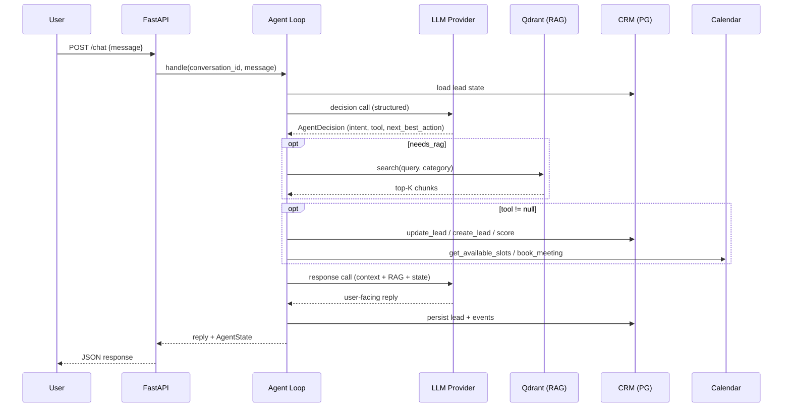

# AI Sales Agent — Architecture

## 1. Overview

**AI Sales Agent** — автономный AI-агент первой линии продаж. Он не «отвечает на сообщения», а ведёт процесс: анализирует состояние лида, выбирает следующее действие, вызывает внешние инструменты (CRM, Calendar, RAG), изменяет состояние внешних систем и двигает пользователя к бизнес-цели — qualified lead + booked meeting.

```
User message
   ↓
FastAPI POST /chat
   ↓
Agent Loop (orchestrator)
   ├─ load conversation (short-term memory)
   ├─ load lead state (long-term memory)
   ├─ LLM Decision Call (structured output: intent, tool, next_best_action, …)
   ├─ [optional] RAG: search_knowledge_base → context injection
   ├─ [optional] Tool execution (CRM / scoring / calendar)
   ├─ LLM Response Call (final user-facing text, RAG-grounded)
   ├─ state update (stage, score, events)
   └─ persist conversation + lead + events
   ↓
Response + AgentState (для demo dashboard)
```

## 2. Компоненты

| Компонент | Технология | Ответственность |
|---|---|---|
| API layer | FastAPI | `/chat`, `/leads`, `/conversations`, `/health` |
| Agent core | Python, Pydantic | agent loop, state machine, decision orchestration |
| LLM service | OpenAI / Anthropic (провайдер-независимый слой) | structured decision + response generation |
| RAG | Qdrant (prod) / ChromaDB (local MVP) + embeddings API | поиск по knowledge base |
| CRM (mock) | PostgreSQL + SQLAlchemy | leads, lead_events |
| Calendar (mock) | PostgreSQL (meetings) + слот-генератор | availability + booking |
| Memory | Redis (short-term) + PG (long-term) | история диалога и профиль лида |
| Scoring engine | YAML config + Python | configurable lead score |
| Frontend | Static HTML/JS (served by FastAPI) | Client Chat + Agent State + /leads dashboard |
| Infra | Docker Compose | backend, postgres, redis, qdrant |

## 3. Ключевые архитектурные решения

### 3.1 Agent = decision loop, а не единственный LLM-вызов

Каждое сообщение пользователя обрабатывается в два LLM-шага:

1. **Decision call** — LLM возвращает строгий `AgentDecision` (Pydantic): intent, needs_rag, tool + arguments, missing_fields, next_best_action, should_offer_meeting. Это «мозг» агента.
2. **Response call** — LLM генерирует пользовательский текст с учётом: decision, RAG-контекста (если был), состояния лида, последних сообщений.

**Почему:** разделение позволяет backend'у надёжно исполнять решения LLM программно (structured output), а RAG-контекст добавлять только в шаг генерации ответа — не загрязняя decision-контекст. Ошибка одного шага не ломает другой.

### 3.2 LLM provider abstraction

`LLMProvider` — Protocol с методом `complete_structured(schema, messages)`. Реализации: `OpenAIProvider`, `AnthropicProvider`. Выбор через `LLM_PROVIDER` env. Structured output: OpenAI — JSON mode / tool schema; Anthropic — tool use с принудительным вызовом.

**Почему:** требование заменяемости провайдера + защита от vendor lock-in, что часто спрашивают на интервью.

### 3.3 Tool registry (не хардкод if/else)

Каждый tool — класс `Tool` с: именем, Pydantic input/output схемой, executor'ом. Agent получает из decision имя tool + arguments → валидация схемой → исполнение → лог результата. Неизвестный tool / невалидные аргументы → структурированная ошибка, возвращаемая в response-шаг, агент честно сообщает о проблеме.

**Почему:** единая точка валидации, логирования, обработки ошибок и расширения (добавить tool = один класс + регистрация).

### 3.4 Mock CRM как отдельный сервисный слой

CRM — не «таблица в базе», а `CRMService` над PostgreSQL с бизнес-операциями: `create_lead`, `update_lead`, `get_lead`, `append_event`. Каждая мутация пишет событие в `lead_events` (audit trail). В будущем слой заменяется реальным HubSpot/Bitrix24 adapter'ом без изменения агента.

**Почему:** агент зависит от интерфейса CRM, а не от БД — это и делает историю портфолио правдоподобной.

### 3.5 RAG с metadata-фильтрацией

Knowledge base — markdown-документы, чанкинг при ingestion, каждый chunk получает metadata (`source`, `category`, `service`). Поиск: embedding query → vector search (top-K) → опциональный фильтр по category из decision. В LLM уходят только релевантные чанки с указанием source.

**Почему:** бизнес-знания отделены от system prompt (обновление без деплоя агента), метаданные дают точность, а цитирование source в промпте снижает галлюцинации по ценам/кейсам.

### 3.6 Память: два уровня, разная ответственность

- **Short-term (Redis):** последние N сообщений диалога (ring buffer), ключ `conv:{id}`. Быстро, с TTL.
- **Long-term (PG):** структурированный профиль лида (поля qualification) + `lead_events`. Не каждое сообщение — только значимая информация (решение принимает LLM в decision: `memory_updates: {field: value}` при полезности).

**Почему:** не задавать вопросы повторно, переживать рестарт сервиса, держать контекст диалога дешёвым.

### 3.7 Scoring как конфигурация, не код

`config/scoring.yaml`: веса критериев (need/budget/urgency/authority/fit/volume), пороги (0–39 low, 40–69 potential, 70–100 qualified). `ScoringEngine` читает конфиг и вычисляет score + reasons. Пересчёт — детерминированный, не через LLM.

**Почему:** требование configurable + объяснимость: каждый score сопровождается списком причин (для dashboard и для «почему агент предложил встречу»).

### 3.8 State machine лида

Стадии: `new → engaged → qualification → qualified → meeting_proposed → meeting_booked` (+ `unqualified`, `not_interested`, `closed`). Переходы выполняет агент на основании decision (`stage` поле), допустимые переходы валидируются схемой. Все переходы — события в `lead_events`.

**Почему:** явная машина состояний = предсказуемость, тестируемость и наглядность в demo dashboard.

### 3.9 Естественная квалификация (anti-interrogation)

Decision-промпт содержит приоритизацию недостающих полей (`missing_fields` + `next_best_action`) и правило: **один первичный вопрос за сообщение**, вопрос строится из контекста последнего ответа. Порядок важности полей конфигурируется (сначала problem → channels → volume → software → budget → deadline → authority → contacts).

**Почему:** главная разница между sales-агентом и анкетой; явно демонстрируется в demo scenario.

### 3.10 Error handling: деградация, а не падение

Каждая внешняя зависимость обёрнута: LLM unavailable → fallback-ответ + статус degraded; RAG down → ответ без KB с честной оговоркой; CRM down → события буферизуются в лог, агент продолжает диалог; calendar down → не предлагаем встречу. Tool errors возвращаются в response-шаг структурированно.

**Почему:** требование ТЗ — диалог не должен ломаться из-за одного сервиса; плюс это сильный сигнал senior-уровня в портфолио.

### 3.11 Observability

Structured JSON-логи (structlog): conversation_id, lead_id, intent, tool name/args/result, latency, error, timestamp. Tool calls также персистятся (таблица `tool_calls` / события) — их видит demo dashboard в реальном времени. Секреты никогда не логируются.

**Почему:** интерь^вью-вопрос «как вы дебажите агента в проде» закрыт по умолчанию.

## 4. Модели данных

### leads (PostgreSQL)

`id, conversation_id, name, company, email, phone, industry, company_size, business_problem, desired_solution, channels (JSONB), current_software, current_process, monthly_leads, monthly_customer_requests, budget_range, deadline, decision_maker, urgency, additional_notes, lead_score, lead_quality, status, next_best_action, meeting_datetime, meeting_id, created_at, updated_at`

### lead_events

`id, lead_id, event_type, payload (JSONB), created_at`
Типы: `lead_created, qualification_started, field_updated, score_changed, stage_changed, meeting_proposed, meeting_booked, tool_called, error`

### conversations / messages

`conversations: id, lead_id, created_at`
`messages: id, conversation_id, role, content, intent, decision (JSONB), created_at`

### meetings

`id, lead_id, datetime, duration_minutes, timezone, status, meeting_url, created_at`

## 5. Agent state (внутреннее, per message)

```json
{
  "intent": "new_lead",
  "stage": "qualification",
  "needs_rag": false,
  "tool": "update_lead",
  "tool_arguments": {},
  "memory_updates": {"channels": ["WhatsApp", "website"], "monthly_leads": 500},
  "missing_fields": ["monthly_leads", "budget_range"],
  "lead_score_required": true,
  "next_best_action": "ask_volume",
  "should_offer_meeting": false,
  "response": "..."
}
```

Валидируется Pydantic-схемой `AgentDecision` — никакого парсинга регэкспами.

## 6. Sequence (happy path)



## 7. Интеграции, заменяемые интерфейсами

- `LLMProvider` → OpenAI / Anthropic
- `VectorStore` → Qdrant / ChromaDB
- `CRMService` → mock PG-CRM / реальный CRM adapter
- `CalendarService` → mock slot-engine / Google/Calendly adapter

Все четыре — точки расширения, которые в README объясняются как «production-ready path».
